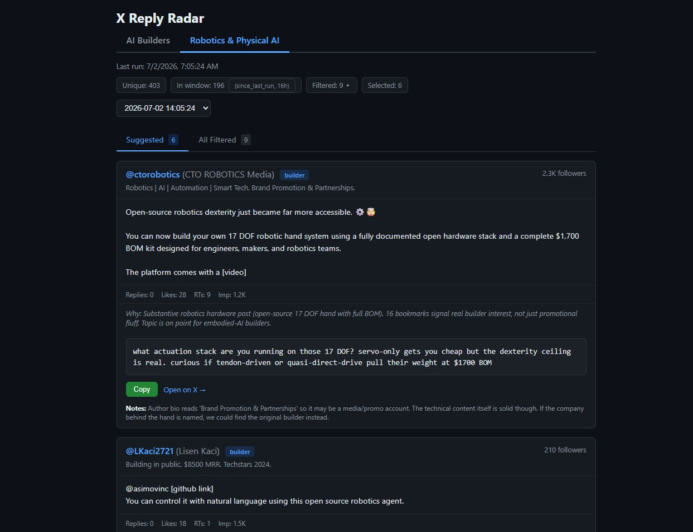

# X Reply Radar

Strategic X/Twitter engagement finder with a web dashboard. Searches X for recent posts worth replying to, filters out noise, drafts replies in your voice for manual review - **never auto-posts**.



## What it does

1. **Searches** X for recent posts matching your target audience
2. **Filters** out buried threads, dead posts, retweets, crypto, and philosophical noise
3. **Ranks** by builder signals + engagement to surface the best candidates
4. **Drafts** replies in your voice for manual review and posting
5. **Dashboard** - browsable web UI with tabs, copy buttons, history, and on-demand reply generation

You post the replies yourself on X. This tool never auto-posts.

## Architecture

```
search.py  →  candidates.json  →  server.py (dashboard on :8747)
                              ↘  results/results_YYYYMMDD_HHMMSS.json
```

| Component | Description |
|-----------|-------------|
| `search.py` | Standalone search script. Calls `xurl` via subprocess, filters/dedupes, writes `candidates.json` with top 15 ranked + all filtered posts. No external dependencies. |
| `server.py` | Zero-dependency web dashboard (Python stdlib `http.server` only - no Flask). Serves a single-page app with inline JS/CSS. |
| `results/` | Timestamped JSON files from each cron/manual run. |
| `candidates.json` | Latest raw candidates (intermediate file). |

## Requirements

- **Python 3.8+** (stdlib only - no pip install needed)
- **[xurl](https://github.com/xdevplatform/xurl)** - X's official curl-like CLI for the X API. Handles OAuth and lets you hit raw API v2 paths (`xurl /2/tweets/search/recent?...`, which `search.py` uses) as well as convenience **shortcut commands** like `xurl whoami`, `xurl read POST_ID`, and `xurl search "QUERY"`. See [xurl shortcuts](#xurl-commands-used) below.
- **An X API project** with access to the v2 recent-search endpoint (`GET /2/tweets/search/recent`). This is a *read* endpoint - make sure your [X API plan](https://developer.x.com/en/portal/products) includes it; the Free tier's read access is limited. Run `xurl /2/tweets/search/recent?query=test&max_results=10` to confirm your credentials can reach it.
- **Optional**: an LLM API key for on-demand reply generation. Pick one of [Together AI](https://together.ai), [OpenAI](https://platform.openai.com), or [Anthropic](https://console.anthropic.com) (see [LLM provider](#llm-provider) below). Works without it; you just don't get the "Generate Reply" button.

### xurl commands used

The interactive/skill workflow leans on a few of xurl's [shortcut commands](https://github.com/xdevplatform/xurl) (run `xurl --help` for the full list):

| Command | Purpose |
|---------|---------|
| `xurl auth status` | Show which apps/accounts are authenticated |
| `xurl whoami` | Confirm the authenticated account (used to skip your own posts) |
| `xurl read POST_ID_OR_URL` | Fetch a single post's full text + metrics for context |
| `xurl search "QUERY"` | Quick recent-search from the shell |

The standalone `search.py` does **not** use the shortcuts - it calls the raw `/2/tweets/search/recent` path directly so it can request specific `tweet.fields`/`expansions` in one query.

## Quick Start

### Tell your agent to install (recommended for remote Hermes)

If you run Hermes Agent on a remote server (VPS, Docker, etc.), give your agent the install command and ask it to run it:

> Install x-reply-radar: run `curl -fsSL https://raw.githubusercontent.com/shane-farkas/hermes-x-reply-radar/main/install.sh | bash`

Your agent will execute the installer on the server where Hermes runs.

### One-line install (local Hermes only)

If you have direct shell access to the machine where Hermes runs:

```bash
curl -fsSL https://raw.githubusercontent.com/shane-farkas/hermes-x-reply-radar/main/install.sh | bash
```

The installer detects whether you're running Hermes Agent and installs accordingly:
- **Hermes**: copies `SKILL.md` to `~/.hermes/skills/social-media/x-reply-radar/`
- **Other agents**: copies scripts to `./` for direct invocation

### Manual setup

```bash
# Clone
git clone https://github.com/shane-farkas/hermes-x-reply-radar.git
cd hermes-x-reply-radar

# Create data directory
mkdir -p ~/.x-reply-radar/results

# Verify xurl is installed and authenticated
xurl auth status
xurl whoami

# Run a search
python3 search.py

# Start the dashboard
python3 server.py
# → open http://localhost:8747
```

## Configuration

All configuration is via environment variables:

| Variable | Default | Description |
|----------|---------|-------------|
| `X_REPLY_RADAR_DIR` | `~/.x-reply-radar` | Data directory for candidates.json and results/ |
| `X_REPLY_RADAR_XURL` | `~/.local/bin/xurl` | Path to xurl binary |
| `X_REPLY_RADAR_MY_ID` | _(empty)_ | Your X user ID - skips your own posts |
| `X_REPLY_RADAR_QUERIES` | _(built-in defaults)_ | Comma-separated search queries (overrides defaults) |
| `X_REPLY_RADAR_HOST` | `127.0.0.1` | Dashboard bind address. Defaults to localhost only; set `0.0.0.0` to expose on a trusted network (no auth - see warning below) |
| `X_REPLY_RADAR_PORT` | `8747` | Dashboard port |
| `X_REPLY_RADAR_LLM_PROVIDER` | `together` | Which LLM to use: `together`, `openai`, or `anthropic` |
| `TOGETHER_API_KEY` / `OPENAI_API_KEY` / `ANTHROPIC_API_KEY` | _(env)_ | API key for your chosen provider. `X_REPLY_RADAR_API_KEY` works as a generic fallback |
| `X_REPLY_RADAR_LLM_MODEL` | provider default | Model for reply generation (defaults: `meta-llama/Llama-3.3-70B-Instruct-Turbo`, `gpt-4o-mini`, `claude-haiku-4-5`) |
| `X_REPLY_RADAR_LLM_URL` | provider default | Override the API endpoint (useful for any OpenAI-compatible host) |
| `X_REPLY_RADAR_REPLY_PROMPT` | _(built-in default)_ | System prompt for reply generation |

### Customizing search queries

The default query set targets AI builders. For other audiences, set `X_REPLY_RADAR_QUERIES` or edit the `DEFAULT_QUERIES` list in `search.py`.

### LLM provider

The "Generate Reply" button (and the cron drafting flow) calls one LLM provider. Set `X_REPLY_RADAR_LLM_PROVIDER` and the matching API key:

```bash
# Together (default) - Llama-3.3-70B
export TOGETHER_API_KEY=your_key_here

# OpenAI - gpt-4o-mini
export X_REPLY_RADAR_LLM_PROVIDER=openai
export OPENAI_API_KEY=your_key_here

# Anthropic - claude-haiku-4-5
export X_REPLY_RADAR_LLM_PROVIDER=anthropic
export ANTHROPIC_API_KEY=your_key_here
```

`together` and `openai` use the OpenAI-compatible chat-completions API; `anthropic` uses the Messages API. Each provider has a sensible default model; override it with `X_REPLY_RADAR_LLM_MODEL`. To point at any other OpenAI-compatible host (a local model, a proxy, OpenRouter, etc.), keep the provider on `openai` and set `X_REPLY_RADAR_LLM_URL`. Keys can also live in `~/.x-reply-radar/.env` instead of the environment.

### Customizing the reply prompt

Set `X_REPLY_RADAR_REPLY_PROMPT` to control how the LLM drafts replies. The default is generic, so add your name, projects, and style rules:

```bash
export X_REPLY_RADAR_REPLY_PROMPT="You draft replies as [your name]. Rules: casual, lowercase, one sharp question per reply. Never cheerlead. Keep under 280 chars."
```

Or write it to `~/.x-reply-radar/.env` (any of the supported key names works here):

```
ANTHROPIC_API_KEY=your_key_here
X_REPLY_RADAR_LLM_PROVIDER=anthropic
X_REPLY_RADAR_REPLY_PROMPT=Your custom system prompt here
```

## Automated Mode (cron + systemd)

### systemd service

```ini
# ~/.config/systemd/user/x-radar.service
[Unit]
Description=X Reply Radar Dashboard
After=network.target

[Service]
Type=simple
ExecStart=/usr/bin/python3 /path/to/x-reply-radar/server.py
Restart=always
RestartSec=5
Environment=HOME=/home/user

[Install]
WantedBy=default.target
```

```bash
systemctl --user daemon-reload
systemctl --user enable --now x-radar.service
```

### Cron job

Run `search.py` every 4 hours via crontab or your scheduler:

```bash
# crontab -e
0 */4 * * * X_REPLY_RADAR_DIR=/home/user/.x-reply-radar /usr/bin/python3 /path/to/x-reply-radar/search.py
```

The dashboard auto-refreshes every 5 minutes, so new results appear without a manual refresh.

### Results JSON schema

Each run writes `results_YYYYMMDD_HHMMSS.json`:

```json
{
  "timestamp": "ISO 8601 UTC",
  "stats": {"total_unique": N, "recent_4h": N, "after_filters": N, "selected": N},
  "candidates": [
    {
      "id": "post id",
      "url": "https://x.com/username/status/ID",
      "username": "handle",
      "author_name": "display name",
      "author_bio": "bio text",
      "followers": N,
      "text": "full post text",
      "metrics": {"replies": N, "likes": N, "retweets": N, "impressions": N},
      "is_builder": true,
      "why_selected": "1-2 sentences",
      "draft_reply": "the drafted reply text",
      "notes": "relevant notes"
    }
  ],
  "filtered_all": [...]
}
```

## Dashboard UI

The dashboard is a single-page app served by `server.py` on port 8747. The screenshot at the top shows the Robotics & Physical AI track with two surfaced candidates.

Features:
- **Suggested tab** - selected candidates with draft replies, copy buttons, "Open on X" links
- **All Filtered tab** - every post that passed filters but wasn't selected. Each card has a "Generate Reply" button for on-demand LLM drafting.
- **History dropdown** - browse past runs
- **Copy buttons** - with `execCommand` fallback for non-HTTPS access (e.g. over Tailscale IP)
- **Auto-refresh** - every 5 minutes

Each card shows the author + bio, the post text, engagement metrics (replies, likes, retweets, impressions), the AI's reasoning for why it was selected, the suggested draft reply, and any notes (e.g. flagging accounts that may be promotional rather than the original builder).

## Hermes Agent Integration

This repo includes a `SKILL.md` for [Hermes Agent](https://hermes-agent.nousresearch.com/) users. If you run Hermes, the skill enables a chat-driven workflow where the agent runs searches, reads full post context, and drafts replies in your voice - all from a messaging platform like Telegram.

See [`SKILL.md`](SKILL.md) and [`references/dashboard-setup.md`](references/dashboard-setup.md) for the full Hermes integration guide.

### Setting up a new track or objective

Once installed, the radar defaults to a single AI Builders track with built-in queries and filter rules. To point it at a different audience or goal, just ask your Hermes agent in plain language. The agent will update the search script and cron job for you.

**Example prompts** (copy-paste these into your Hermes chat):

> Set up an x-reply-radar for indie SaaS founders shipping dev tools. Find posts where they're building, asking for feedback, or stuck on something. Skip generic "growth advice" content and any posts mentioning crypto. Use these queries: `"just shipped" SaaS`, `"working on" dev tool`, `"built a" CLI`, `"looking for feedback" SaaS`, `"struggling with" auth`. Filter out posts with < 5 likes and skip authors under 500 followers. Draft replies that ask one pointed question about their tech stack.

> Add a second x-reply-radar track for drone autonomy and PX4/ArduPilot developers. Search for: `PX4`, `ArduPilot`, `"offboard mode"`, `MAVROS`, `ROS2 drone`, `#dronedev lang:en`. Skip pure research papers and job postings. Reply with technical questions about their control stack, sim-to-real setup, or compute budget.

> Set up an x-reply-radar for climate tech founders. Find posts about: carbon capture startups, grid storage, climate fundraising rounds, Series A climate. Skip crypto-flavored "carbon credits" and policy-only posts. Draft replies asking about their hardware, supply chain, or unit economics. Casual lowercase voice, no em dashes.

> Make a research-only x-reply-radar for ML papers and benchmarks. Search: `arxiv.org`, `"benchmark results"`, `"SOTA"`, `"trained a model"`. No reply drafting - just collect the post links and authors into a daily digest I can scan. Skip posts without a paper link.

> Switch my existing x-reply-radar queries to focus on agent infrastructure specifically: memory, RAG, tool use, evals. Queries: `"agent memory"`, `"RAG"`, `"tool use"`, `"agent eval"`, `"context engineering"`. Builder signals should include: agent, memory, RAG, evals, MLOps, LangChain, LlamaIndex, vector.

**What Hermes will change behind the scenes:**
- Edit `search.py`'s `QUERIES` list (or add `X_REPLY_RADAR_QUERIES` to your env)
- Update `builder_signals` inside `search.py`'s `main()` to match your audience vocabulary
- Add any domain-specific skip rules (e.g. crypto terms, research-paper-only posts)
- Recreate or update the cron job with the new goal + style rules in the prompt
- Restart the dashboard service

**Multi-track setup:** Each track needs its own search script, state file, results dir, and cron job with a 5-minute stagger between scheduled times (e.g. `0 7,15 * * *` and `5 7,15 * * *`). Hermes handles the boilerplate; just say "add a second track for X" and it will scaffold the files, set up the cron, and verify the dashboard shows the new tab.

**Tips for good prompts to Hermes:**
- Name the audience concretely ("indie SaaS founders shipping dev tools", not "tech people")
- List 3-6 example queries you want it to run (Hermes can add more, but seeds help)
- Call out what to skip (crypto, motivational, generic advice, retweets)
- Specify your voice (casual/technical/brief, what to avoid like em dashes or AI vocab)
- Mention any repo context if you want the agent to reference your projects in replies

For the underlying mechanics, see `references/multi-track-deployment.md`.

## How filtering works

Posts are filtered out if they:
- Are retweets (no original text)
- Have >50 replies (your reply gets buried)
- Have zero engagement (likes, replies, retweets all 0)
- Are crypto-adjacent (text or author bio contains crypto terms)
- Are purely philosophical/motivational
- Are generic founder advice ("how to raise", "startup advice", etc.)
- Are from your own account (if `X_REPLY_RADAR_MY_ID` is set)

Authors are tagged as "builders" if their bio/name contains signals like: building, shipping, engineer, founder, developer, maker, tinker, hardware, software, AI, ML, robot. Builder-tagged posts rank higher.

## Security

The dashboard has **no authentication**. Keep this in mind:

- **It binds to `127.0.0.1` (localhost) by default.** Only your machine can reach it. To expose it (e.g. over a Tailscale/VPN IP), set `X_REPLY_RADAR_HOST=0.0.0.0` - but only on a trusted network. server.py prints a warning when bound beyond loopback.
- **The `/api/generate-reply` endpoint spends your LLM API key.** Anyone who can reach an exposed dashboard can run up LLM costs. If you must expose it publicly, put it behind a reverse proxy with auth (or an SSH tunnel) rather than binding `0.0.0.0` directly.
- **Never commit secrets.** `.env` files, `candidates.json`, and `results/` are gitignored. Keep your LLM API key and xurl OAuth tokens out of the repo.
- **This tool never posts.** It only reads public posts and drafts replies for you to copy and post manually.

## License

MIT - see [LICENSE](LICENSE).
